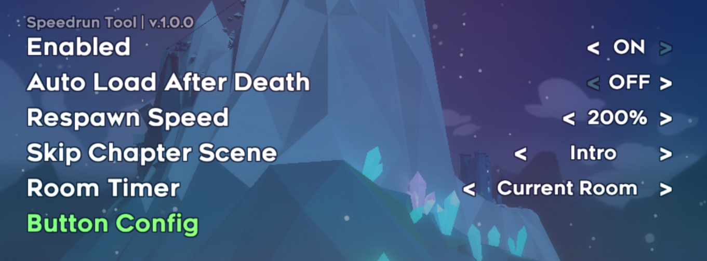
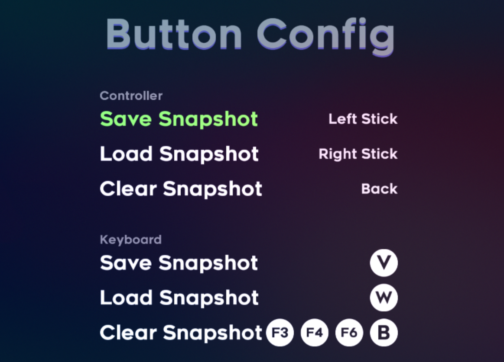

# Celeste Speedrun Tool

[中文说明](./README_CN.md)

## Download
[GitHub](https://github.com/DemoJameson/CelesteSpeedrunTool/releases) or [GameBanana](https://gamebanana.com/tools/6597)

## Features

1. Quickly save player and room snapshot with custom buttons.
2. Automatically load snapshot after death.
3. Speed up the respawn process.
4. Add a timer for a single room which supports recording the best time and timing between the 7th chapter flags
5. Remove the postcard and chapter completion scene.
6. Fixed some problems after teleporting via the map editor. For example, 2A could not dreamdash and activated badeline, 3A huge mess hall was too bright, and the 8th chapter was in the wrong fire state.

## Previews

## Credits

[Matt Makes Games Inc.](http://www.mattmakesgames.com/) —— Thanks to them for developing [Celeste](http://www.celestegame.com/), my favorite platform game.
[Everest](https://everestapi.github.io/) —— Celeste Mod loader, without it there is no this Mod
[Ahorn](https://github.com/CelestialCartographers/Ahorn) —— Very convenient for finding the name of an entity
[FMOD](https://www.fmod.com/) —— Provides Celeste audio project
西瓜 —— Helped me test