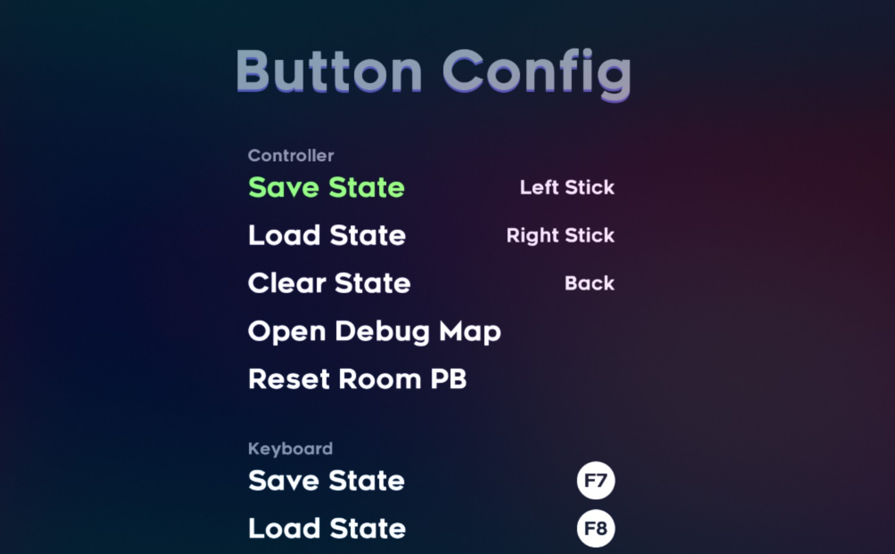

# Celeste Speedrun Tool

[中文说明](./README_CN.md)

## Download
[GameBanana](https://gamebanana.com/tools/6597)

## Features

- Create save states* to practice certain segments of the room, automatically loaded after death. Customizable keyboard/controller shortcut for saving and loading. 
- Room timer compatible with Summit flags. Personal best is recorded.
- Statistics on deaths, including location, time lost, etc.
- Controller support for debug map: use confirm to teleport, right analog to zoom.
- Debug mode F6 teleport bug-fix – Dream blocks and Badeline not activating in Old Site, incorrect ice/fire state in Core, Celestial Resort huge mess hall being strangely lit, wind sound does not play in Summit 2000m.

## Previews

## Acknowledgments

- A huge shout-out to [Extremely OK Games, Ltd.](https://exok.com/) for designing [Celeste](http://www.celestegame.com/) , it has been my favorite platformer ever since.
- [Everest](https://everestapi.github.io/) – Celeste Mod Loader and modding API, making this Mod a reality.
- [Ahorn](https://github.com/CelestialCartographers/Ahorn) – Map maker and level editor, useful for identifying different entities in the game.
- [Power Up Audio](https://www.powerupaudio.com/) – Curated library of high-quality sound effects for games, used to acquire Celeste audio project
- [西瓜](https://space.bilibili.com/18705633), [buhbai](https://www.speedrun.com/user/buhbai), [Evansfight](https://www.speedrun.com/user/Evansfight), [Lev067](https://www.speedrun.com/user/Lev067), [sonicyellow](https://www.speedrun.com/user/sonicyellow), [nameguy](https://gamebanana.com/members/1653060) – Mod tester.
- [rjdimo](https://steamcommunity.com/id/rjdimo/) – Shameless self-promoting translator of this readme file.