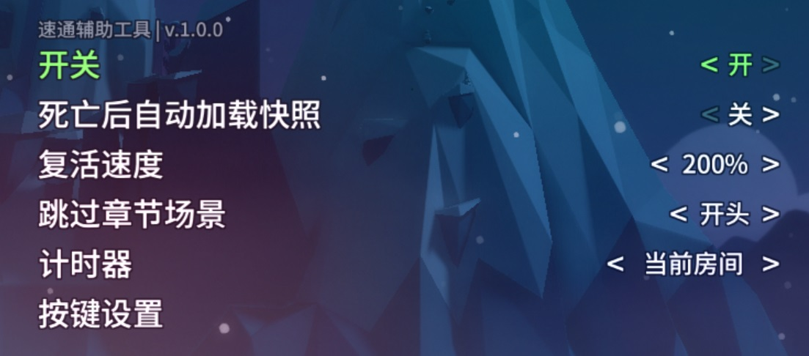
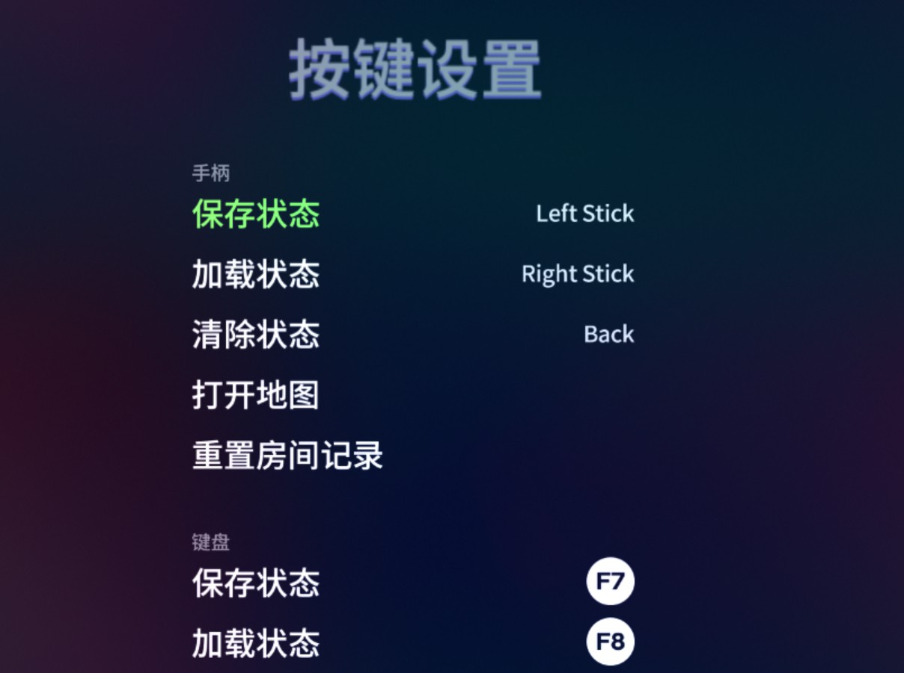

# Celeste 速通辅助工具

## 下载
[GameBanana](https://gamebanana.com/tools/6597)

## 功能
- 通过自定义的按键快速保存恢复状态
- 死亡时自动加载状态
- 统计死亡数据，包括位置，损失的时间等
- 增加单个房间类型的计时器，支持记录最佳时间与第七章旗子间的计时
- 只用游戏手柄就也可以使用 Debug 地图，确认键选择房间，右摇杆缩放（已经整合到最新的 Everest 版本中）
- 修复游戏本身通过地图传送到 2A 的房间后无法激活梦幻方块和 Badeline 追逐战的问题
- 修复游戏本身通过地图传送到 3A 杂物大厅光线亮度不对的问题
- 修复游戏本身通过地图传送到第 7 章 2000m 后不播放风声的问题
- 修复游戏本身通过地图传送到第 8 章的房间后冰火状态不正确的问题

## 预览

## 致谢
- [Extremely OK Games, Ltd.](https://exok.com/) —— 感谢他们开发出了 [Celeste](http://www.celestegame.com/) 这款我最爱的平台跳跃游戏
- [Everest](https://everestapi.github.io/) —— Celeste Mod 加载器，没有它就没有这个 Mod
- [Ahorn](https://github.com/CelestialCartographers/Ahorn) —— 用来查找物体在游戏代码里的命名
- [Power Up Audio](https://www.powerupaudio.com/) —— 提供了 Celeste 的音频工程，处理音频时可以预先试听
- [西瓜](https://space.bilibili.com/18705633), [buhbai](https://www.speedrun.com/user/buhbai), [Evansfight](https://www.speedrun.com/user/Evansfight), [Lev067](https://www.speedrun.com/user/Lev067), [sonicyellow](https://www.speedrun.com/user/sonicyellow) — 测试与反馈
- [rjdimo](https://space.bilibili.com/11670105) —— 上门推销将本说明翻译成了英文